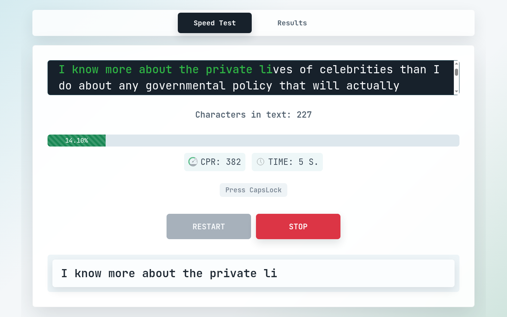
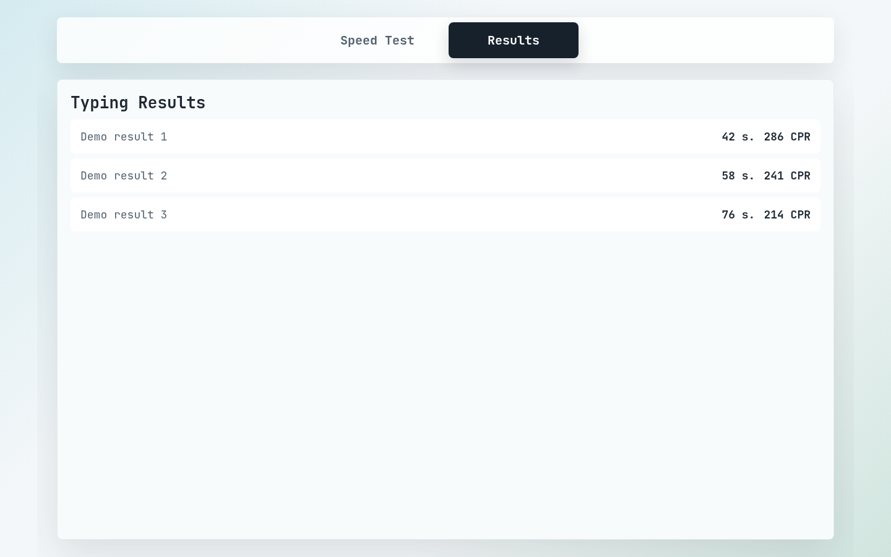
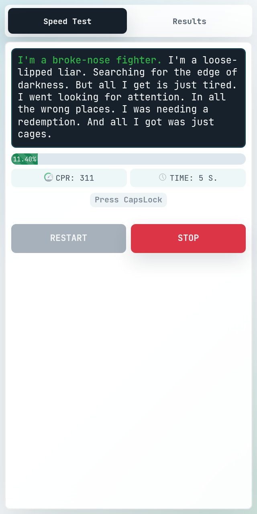
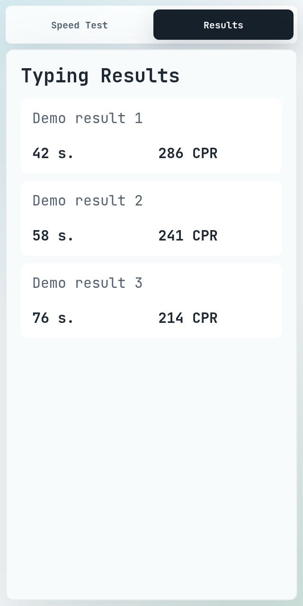

# Type Speed Checker

Type Speed Checker is a typing speed test app. Start a test, type the generated text, track your progress, and save finished results in the browser.

## Main Features

- Random typing text for each test.
- Live highlighting for correct and incorrect characters.
- Smooth progress bar with decimal percentage.
- Typing time tracking.
- Characters per minute tracking.
- Automatic test completion when the text is finished.
- Saved typing results with time and characters per minute.
- Separate `Speed Test` and `Results` pages.
- Responsive layout for desktop, tablet, and phone screens.
- Compact mobile UI with hidden visual input on small phones.
- Global JetBrains Mono font for better character readability.
- Redesigned interface in version 2.

For detailed version 2 changes, see [Patch Notes](./PATCH_NOTES.md).

## Screenshots

### On Desktop



### On Desktop



### On Mobile



### Results On Mobile



## How It Works

The app selects a random text when the test starts. While the user types, it compares the typed value with the original text, updates progress, tracks elapsed time, and calculates characters per minute. When the full text is typed, the test stops and the result is saved to `localStorage`.

## Run Locally

Node.js `24.x` is recommended for Vercel deployments.

Install dependencies:

```bash
npm install
```

Start the development server:

```bash
npm run dev
```

Build for production:

```bash
npm run build
```

## Tech Stack

React, TypeScript, Redux Toolkit, Vite, Bootstrap, Semantic UI React, SCSS.
